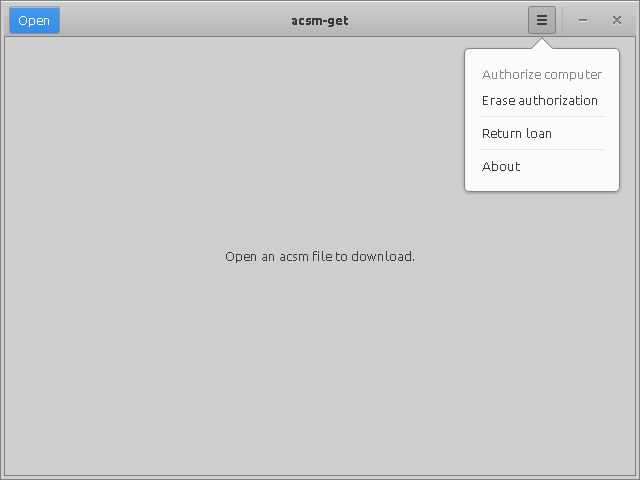

Introduction
------------

acsm-get is a tool to download e-books with Adobe DRM. It was made to give Linux users a way to download their e-books, since Adobe Digital Editions does not exist for this platform.

It is a GUI for Grégory Soutadé's libgourou, which you can find [here](https://forge.soutade.fr/soutade/libgourou).


Copyright
---------

Copyright (c) 2023 Jan de Vries


License
-------

See [COPYING](COPYING).


Source Code
-----------

You can find the source code on [github](https://github.com/j-vries/acsm-get).

To build it, have a look at [build.md](docs/build.md).


Installation
------------

**apt**

If you are on Ubuntu, you can install the deb package with apt:

```
sudo apt install <path/to/package.deb>
```

This will automatically install any missing dependencies for you.

**dpkg**

Alternatively you can use dpkg:

```
sudo dpkg -i <path/to/package.deb>
```

You may have to manually install missing dependencies.

**source**

If you are building from source, you can install with:

```
make all && sudo make install
```


Screenshots
-----------





